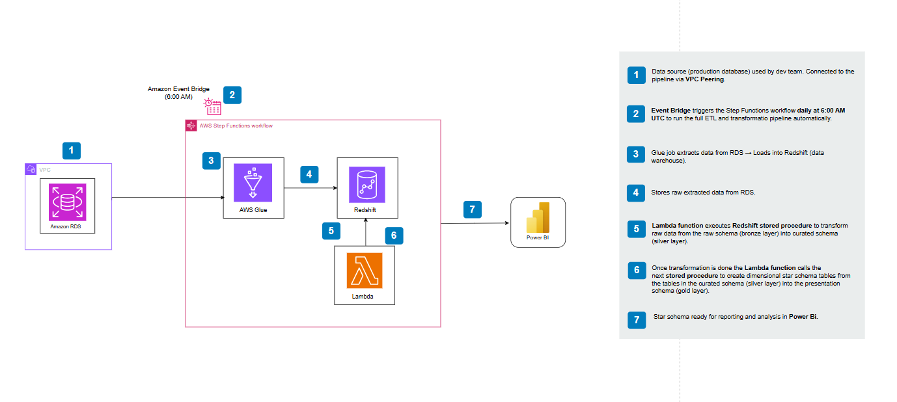

#  SkillBoost Analytics Platform

A production-ready, cost-effective, and secure **batch analytics pipeline** built on AWS. This project ingests task performance data from a backend production database and automates ETL workflows into a dimensional data model ready for analytics with Power BI.

---

##  Architecture Overview



The pipeline is built using a **medallion architecture** (bronze → silver → gold):

- **Amazon RDS (external)** – Hosted in the Dev Team’s AWS account
- **AWS Glue** – Extracts raw data from RDS and loads into Redshift
- **Amazon Redshift**:
  - `raw` schema – stores unprocessed data (bronze)
  - `curated` schema – cleaned and transformed data (silver)
  - `presentation` schema – star schema for analytics (gold)
- **AWS Lambda** – Calls Redshift stored procedures to move data between schemas
- **AWS Step Functions** – Orchestrates the ETL pipeline steps
- **Amazon EventBridge** – Triggers the Step Function **daily at 6:00 AM UTC**
- **Power BI** – Connects to the `presentation` schema for interactive dashboards

---

##  Project Structure

| File / Directory      | Description |
|-----------------------|-------------|
| `main.tf`             | Root Terraform module with all child modules |
| `provider.tf`         | AWS provider configuration |
| `variables.tf`        | Variable definitions |
| `outputs.tf`          | Outputs (Redshift info, Step Function ARNs, etc.) |
| `iam.tf`              | IAM roles/policies for Glue, Lambda, and Step Functions |
| `glue.tf`             | Glue Job definition for RDS → Redshift |
| `connection.tf`       | JDBC connection to the RDS database and redshift |
| `redshift.tf`         | Redshift  cluster setup |
| `stepfunctions.tf`    | Step Function orchestration logic |
| `rds.tf`              | Rds database instance setup |
| `lambda.tf`           | Lambda function to call Redshift stored procedures |
| `scripts/`            | Contains ingestion script, sql stored procedures and lambda function to call the stored procedures|

---

##  Features

- VPC-peered data extraction from an external production DB
- Medallion-based schema layering in Redshift (`raw`, `curated`, `presentation`)
- Fully automated using Step Functions and EventBridge
- Secure IAM policies and private subnet deployments
- BI-ready star schema connected to Power BI

---

##  Prerequisites

-  [Terraform CLI](https://developer.hashicorp.com/terraform/downloads) installed
-  AWS CLI configured with valid credentials
-  Access to the target RDS database (ensure VPC peering and security groups are set)
-  Redshift cluster accessible from your VPC

---

## Deployment

### 1. Clone the repo
```bash
git clone https://github.com/charles-amali/SkillBoost-DataPipeline.git
cd SkillBoost-DataPipeline
```

### 2. Initialize Terraform
```bash
terraform init
```

### 3. Plan your deployment
```bash
terraform plan
```

### 4. Deploy the infrastructure
```bash
terraform apply
```

---

## Data Flow Summary

```
[Amazon RDS (Prod)] 
   ↓ (VPC Peering via Glue)
[AWS Glue Job] 
   ↓
[Redshift raw schema]
   ↓ (Lambda SP1)
[Redshift curated schema]
   ↓ (Lambda SP2)
[Redshift presentation schema]
   ↓
[Power BI Dashboard]
```

- Triggered daily at **6:00 AM UTC** via **EventBridge**
- All orchestrated using **AWS Step Functions**
- **AWS Step Functions** sends email notification on success or on failure
---

## Security Highlights

- All components run inside private subnets
- IAM roles follow least-privilege access

---

## Future Enhancements

- Automate Power BI dataset refresh

---

## License

This project is licensed under the [MIT License](LICENSE).

---

## Contact

Developed by [Charles Adu Nkansah](mailto:charlesadunkansah@gmail.com)  
For contributions, issues, or enhancements, please submit a pull request or open an issue on GitHub.
